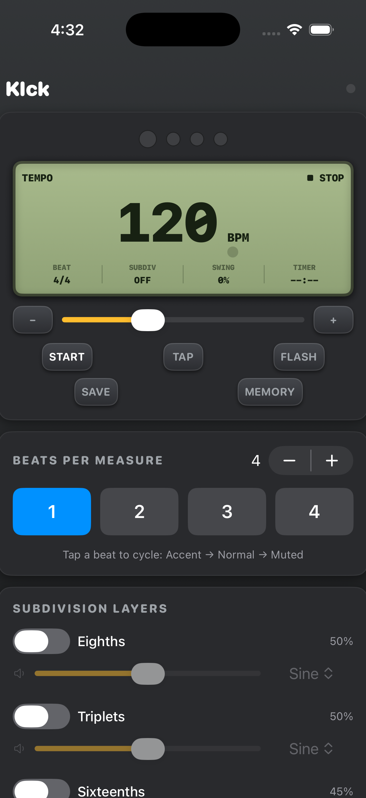

# Klck

<p align="center">
  
</p>

A sample-accurate metronome for macOS and iOS, built with SwiftUI and `AVAudioEngine`.
Designed for practice: per-beat accents, layered subdivisions, swing, a tempo
trainer, Quiet Count, and a practice timer.

An open-source, community-supported metronome.

<p align="center">
  
  &nbsp;&nbsp;
  
</p>

<p align="center"><sub>iPhone (compact layout) and iPad (wide DB-66 layout) &mdash; the same Sources/Klck files build both.</sub></p>

## Features

**Core**
- Tempo 30–300 BPM with slider, ± steppers, and tap tempo (press `T`)
- Up to 16 beats per measure
- Per-beat accent grid — tap a beat to cycle **Accent → Normal → Muted**
- Four independent subdivision layers (8ths, triplets, 16ths, quarters) with
  per-layer volume and mute
- Master volume
- Named preset library, saved to disk and recallable from the sidebar

**Feel & Practice**
- **Swing** — 0–60%, delays off-beat 8th/16th subdivisions toward a triplet feel
- **Per-role sounds** — independent timbre (Sine, Wood, Beep, Click) for the
  accent, the normal beat, and each subdivision layer
- **Quiet Count** — play N bars, then auto-mute M bars so you hold time yourself
- **Tempo Trainer** — ramp BPM from a start to a target by +N every M measures
- **Practice Timer** — run for a set duration with a live countdown, then auto-stop
- **Beat flash** — the screen pulses in time, brighter on the downbeat (toggle)
- **Setlists** — chain presets into an ordered list; step with PREV/NEXT
  (`[` / `]`) or auto-advance each stop after a set number of bars

**Tuner & Tone**
- **Chromatic tuner** — microphone pitch detection with note name, frequency,
  and a ±50-cent meter (autocorrelation + parabolic interpolation)
- **Tone generator** — sustained reference pitch, semitone stepping, A=440
  preset, and volume; runs with or without the metronome

The audio engine computes all click timing in absolute sample frames inside the
`AVAudioSourceNode` render callback, so timing is immune to UI/timer jitter.

The tuner needs microphone access; macOS will prompt on first use.

## Requirements

- macOS 13 or later
- A Swift 6+ toolchain — either **Xcode** or the **Command Line Tools**
  (`xcode-select --install`). Full Xcode is **not** required.

Check your toolchain:

```sh
make version      # or: swift --version
```

## Pre-built downloads (unsigned)

For people who just want to try it without compiling, every push to `main`
publishes fresh per-platform builds via GitHub Actions:

- **Android APK** — <https://github.com/andrewkrug/klck/releases/tag/android-latest>
- **macOS app** — <https://github.com/andrewkrug/klck/releases/tag/macos-latest>
- **iOS IPA (unsigned)** — <https://github.com/andrewkrug/klck/releases/tag/ios-latest>

These are convenience artifacts, not App Store releases. Each release page
has a short install guide; the highlights:

- **Android** — Download the APK to your phone, enable installs from your
  browser/file manager (Settings → Security → Install unknown apps), tap
  the file. The APK is signed with the standard Android debug key so the
  installer accepts it without further steps.
- **macOS** — Download, unzip, drag `Klck.app` into Applications. The first
  launch needs **right-click → Open** (or
  `xattr -dr com.apple.quarantine /Applications/Klck.app`) because the
  bundle is ad-hoc signed instead of Developer-ID signed.
- **iOS** — The published `.ipa` is unsigned and can't install directly.
  Re-sign it with [Sideloadly](https://sideloadly.io/) or
  [AltStore](https://altstore.io/) using your own free Apple ID. The
  release page has step-by-step instructions.

For the official, fully-signed builds, install from the App Store / Mac App
Store / Play Store once they ship.

## Build & run (macOS)

```sh
make            # build + assemble Klck.app  (default target)
make run        # build, then launch the app
make run-console  # launch with log output in the terminal
```

`make` produces `Klck.app` in the project root. Launch it with `open Klck.app`
or double-click it in Finder.

Other targets:

```sh
make help       # list all targets
make debug      # debug build
make check      # type-check only (no bundle)
make release    # clean, then build a fresh bundle
make clean      # remove .build/ and Klck.app
```

Under the hood, `make app` runs `./build_app.sh`, which does
`swift build -c release`, copies the binary and `Resources/Info.plist` into a
`.app` layout, and ad-hoc code-signs it so macOS will run it locally.

## Usage

1. `make run` to launch.
2. Set tempo with the slider, the ± buttons, or tap **Tap** (or press `T`) in
   rhythm.
3. Press **Start** (or the space bar) to begin; press again to stop.
4. Click numbered beats in the grid to set accents (loud), normal, or muted.
5. Toggle subdivision layers and set their volumes in **Subdivision layers**.
6. Open **Feel & Practice** for swing, click sound, Quiet Count, the Tempo
   Trainer, and the Practice Timer.
7. Press **SAVE** to store the full configuration; **MEMORY** recalls or
   deletes presets.
8. In **Tuner & Tone**, press **LISTEN** to tune by mic, or enable **Tone**
   for a reference pitch.
9. In **MEMORY ▸ Setlists**, create a setlist, add presets from the Presets
   tab (**+SET**), optionally set per-stop auto-advance bars, then step with
   **PREV/NEXT** on the deck.

### Keyboard shortcuts

| Key     | Action            |
|---------|-------------------|
| `Space` | Start / Stop      |
| `T`     | Tap tempo         |
| `[`     | Setlist previous  |
| `]`     | Setlist next      |

### Where presets are stored

```
~/Library/Application Support/Klck/presets.json
```

## Build & run (Android)

The Android port lives in [`android/`](android/) as a self-contained Gradle
project. Requires Android Studio (for the bundled JDK 21 + Android SDK at
`~/Library/Android/sdk`); no global Gradle install needed — the wrapper is
checked in.

From the repo root:

```sh
make android-debug     # build debug APK → android/app/build/outputs/apk/debug/
make android-install   # build + install on the connected device or emulator
make android-launch    # force-stop and re-launch on the connected device
make android-logcat    # tail logcat filtered to Klck
make android-emulator  # boot the first available AVD
make android-clean     # gradle :app:clean
make android-release   # build the (unsigned) release APK
```

The Makefile uses Android Studio's bundled JDK by default; override it with
`ANDROID_JAVA=/path/to/another/jdk make android-debug` if you have your own.

A typical first-run on a fresh checkout:

```sh
make android-emulator   # boots an AVD in the background
make android-install    # builds + sideloads the debug APK
make android-launch     # opens Klck on the emulator
```

The Android port mirrors the Swift codebase's audio engine, model, and UI
patterns — see [`android/README.md`](android/README.md) for the architecture
notes (Kotlin model port, AudioTrack render loop mirroring
`AVAudioSourceNode`, Compose UI styled to match the DB-66 chassis aesthetic).

## Project layout

```
Package.swift                 SwiftPM manifest (macOS 13+ / iOS 16+)
Makefile                      build/run/clean for mac + ios + android
build_app.sh                  swift build + macOS .app assembly
project.yml                   XcodeGen spec for the iOS + macOS Xcode targets
Resources/Info.plist          macOS bundle metadata
Sources/Klck/                 shared Swift sources (macOS + iOS)
  KlckApp.swift               @main App entry (cross-platform Scene)
  Audio/AudioEngine.swift     sample-accurate render engine
  Audio/Tuner.swift           chromatic tuner (autocorrelation)
  Model/                      MetronomeModel, SubLayer, Preset, Setlist
  Views/                      SwiftUI interface
android/                      native Kotlin/Compose port (see android/README.md)
.github/workflows/            Pages deploy + per-platform unsigned releases
```

The iOS and macOS apps build from the **same** `Sources/Klck` files; the few
platform differences (audio session, window sizing, idle timer) are handled
with `#if os(iOS)` / `#if os(macOS)`.

## iOS

The macOS app builds without Xcode (`./build_app.sh`). An iOS `.app` must be
produced by Xcode, so the iOS target is described declaratively in
`project.yml` and the Xcode project is generated from it:

```sh
brew install xcodegen     # one-time
make ios-project          # generates Klck.xcodeproj from project.yml
open Klck.xcodeproj        # build/run on a simulator or device
```

`Klck.xcodeproj` is generated and git-ignored — `project.yml` is the source of
truth. For on-device builds, set `DEVELOPMENT_TEAM` in `project.yml`. The iOS
build enables background audio (the click survives a screen lock) and keeps the
screen awake while running.

## Roadmap

iOS app: ready to build (see above). Next: a Watch companion and MIDI clock out.

## License

Released under the [MIT License](LICENSE). Contributions welcome.
