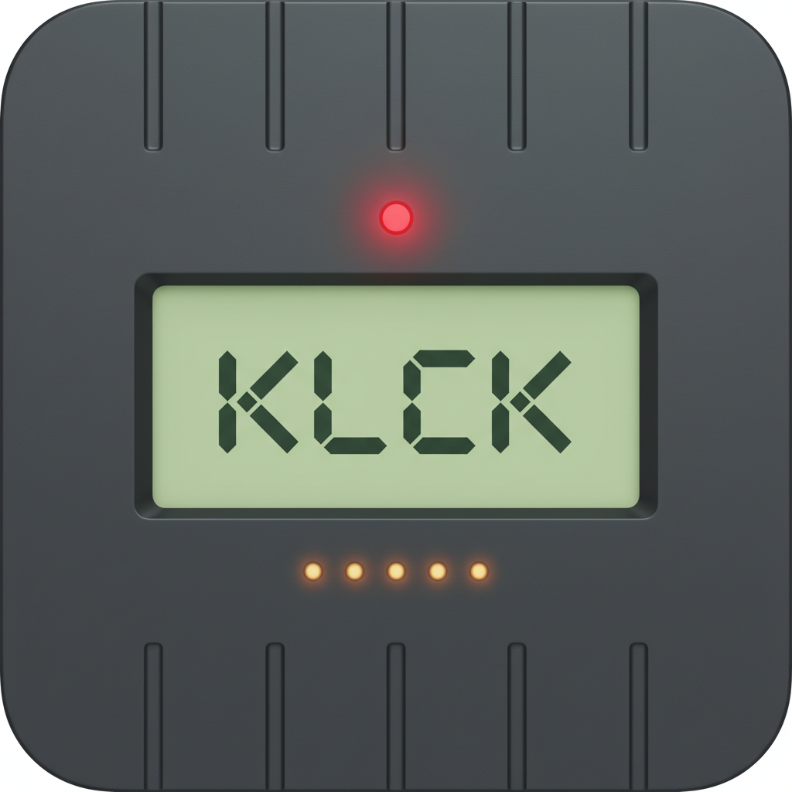
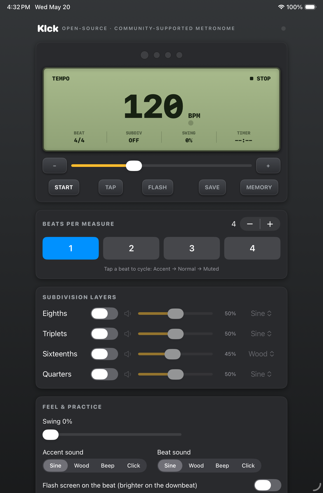

  

<h1 align="center">Klck</h1>

<strong>A sample-accurate metronome for serious practice.</strong>

  Built for musicians who care about timing. Every click is scheduled in absolute sample frames inside the audio engine&rsquo;s render callback, so timing stays rock-solid &mdash; immune to UI jitter, app-switch lag, or system load.

  <strong>Available now on the App Store &mdash; $1.99 for iPhone and iPad.</strong> 
  macOS version coming soon.

  
  &nbsp;&nbsp;
  

iPhone (compact layout) and iPad (wide DB-66 layout) &mdash; the same code, two layouts.

---

## What's in the box

### Core
- Tempo **30&ndash;300 BPM** with slider, &plusmn; steppers, and tap tempo
- **Up to 16 beats** per measure with per-beat accents (Accent &rarr; Normal &rarr; Muted)
- **Four independent subdivision layers** &mdash; 8ths, triplets, 16ths, quarters &mdash; each with its own volume, mute, and timbre
- **Per-role sounds:** pick a distinct waveform (Sine, Wood, Beep, Click) for the accent, the normal beat, and every subdivision layer
- Master volume

### Practice tools
- **Swing 0&ndash;60%** &mdash; delays the off-beat 8th/16th toward a triplet feel
- **Quiet Count** &mdash; play N bars, then auto-mute M bars so you have to hold time yourself
- **Tempo Trainer** &mdash; ramp BPM from a start to a target by +N every M measures
- **Practice Timer** &mdash; run for a set duration with a live countdown, then auto-stop
- **Beat flash** &mdash; the screen pulses on the beat, brighter on the downbeat

### Setlists
- Chain presets into an ordered list and step **PREV / NEXT** through them
- Optional per-stop auto-advance after a set number of bars
- Save and recall named presets that capture the full configuration

### Tuner + tone
- **Chromatic tuner** with note name, frequency, and a &plusmn;50&#8209;cent meter (autocorrelation + parabolic interpolation, on-device)
- **Reference tone generator** with semitone stepping, A&#8203;=&#8203;440 preset, and independent volume &mdash; runs with or without the metronome

---

## Privacy you can verify

Klck collects **nothing**. No accounts, no analytics, no crash reporting, no advertising SDKs, no network requests. The microphone is used only for the on-device tuner and is discarded as soon as it&rsquo;s analyzed for pitch.

You don&rsquo;t have to take my word for it &mdash; [read the privacy policy](privacy/), or [read the source code](https://github.com/andrewkrug/klck).

---

## Open source

Klck is community-supported software released under the [MIT License](https://github.com/andrewkrug/klck/blob/main/LICENSE). The full source is on [GitHub](https://github.com/andrewkrug/klck). Issues, pull requests, and feature ideas are welcome.

---

## Get Klck

- **iPhone &amp; iPad** &mdash; $1.99 on the App Store. Available now.
- **macOS** &mdash; coming soon to the Mac App Store. Same code, native Mac build.
- **Build from source** &mdash; the macOS app builds without Xcode (`make run` with Command Line Tools). See the [README](https://github.com/andrewkrug/klck#readme).

  <a href="https://github.com/andrewkrug/klck">Source on GitHub</a> &middot;
  <a href="privacy/">Privacy</a> &middot;
  <a href="https://github.com/andrewkrug/klck/issues">Support</a>

